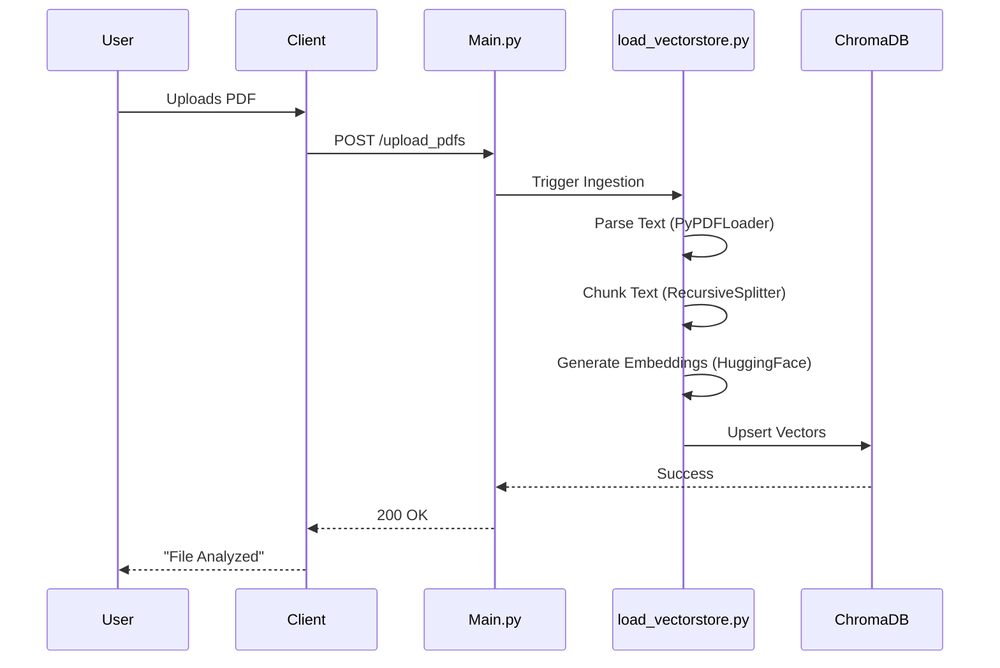
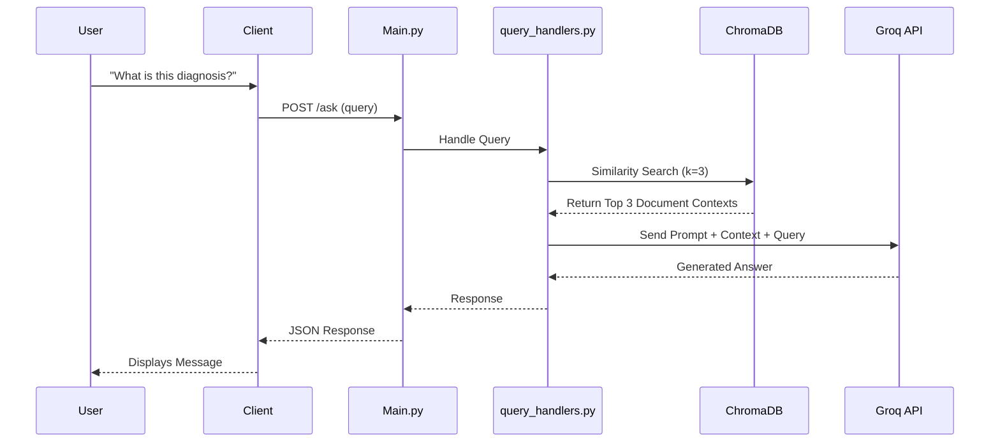

# 🏗️ System Architecture & File Structure

This document provides a deep dive into the technical architecture, file organization, and data flow of **RagBot 2.0**.

---

## 📂 1. Professional File Structure

The project follows a **Micro-Service Style** Monolith, separating concerns clearly between the Presentation Layer (Client) and the Logic/Data Layer (Server).

```m
RagBot-2.0/
├── 📄 README.md                  # Project overview and automated setup guide
├── 📄 ARCHITECTURE.md            # Technical design documentation (This file)
│
├── 📦 client/                    # [PRESENTATION LAYER] Streamlit Application
│   ├── 📄 app.py                 # 🟢 Entry Point: Main UI Thread & Layout Orchestrator
│   ├── 📄 config.py              # ⚙️ Configuration: API Endpoints & Global Constants
│   ├── 📄 requirements.txt       # 📦 Dependencies: Frontend-specific libraries
│   │
│   ├── 📂 components/            # 🧩 UI Modules (Atomic Design Pattern)
│   │   ├── 📄 chat.py            #    - Renders chat bubbles & message history
│   │   └── 📄 upload.py          #    - Handles file drag-and-drop & sidebar logic
│   │
│   └── 📂 utils/                 # 🛠️ Client Utilities
│       └── 📄 api.py             #    - API Wrapper (Requests) to communicate with Backend
│
└── 📦 server/                    # [LOGIC LAYER] FastAPI Application
    ├── 📄 main.py                # 🟢 Entry Point: API Routes (/ask, /upload) & Middleware
    ├── 📄 verify_rag.py          # 🧪 System Check: Verifies DB & LLM connectivity
    ├── 📄 requirements.txt       # 📦 Dependencies: Backend, AI & DB libraries
    ├── 📄 .env                   # 🔑 Secrets: API Keys (e.g., GROQ_API_KEY)
    │
    ├── 📂 modules/               # 🧠 Domain Logic (The "Brain")
    │   ├── 📄 load_vectorstore.py #    - ETL: PDF Parser -> Chunking -> Embedding -> ChromaDB
    │   ├── 📄 llm.py              #    - AI: Llama-3.3 Configuration & Prompt Handling
    │   └── 📄 query_handlers.py   #    - Service: Glues Retrieval + LLM together
    │
    ├── 📂 chroma_db/             # 💾 Data Persistence: Local Vector Database files
    └── 📂 uploaded_pdfs/         # 📂 Temp Storage: Raw uploaded files
```

---

## 🔄 2. Data Flow Architecture

### 2.1 Ingestion Pipeline (PDF to Vector)
When a user uploads a file, it goes through the `load_vectorstore.py` ETL process:



### 2.2 RAG Query Pipeline (Question to Answer)
When a user asks a question, the `query_handlers.py` logic takes over:



---

## 🧩 3. Key Components

### **Vector Database (ChromaDB)**
- **Role**: Long-term memory of the AI.
- **Location**: `./server/chroma_db`
- **Why**: Runs locally, zero latency, no API keys required, persists data across restarts.

### **Embedding Model (all-MiniLM-L6-v2)**
- **Role**: Translates text into numbers (vectors).
- **Location**: Cached locally via `langchain-huggingface`.
- **Performance**: Optimized for CPU usage, ensuring the server runs smoothly on standard laptops.

### **LLM Inference (Groq Llama 3.3)**
- **Role**: The "Reasoning Engine".
- **Why**: Groq's LPU hardware delivers 300+ tokens/sec, making the chat experience feel instantaneous.
