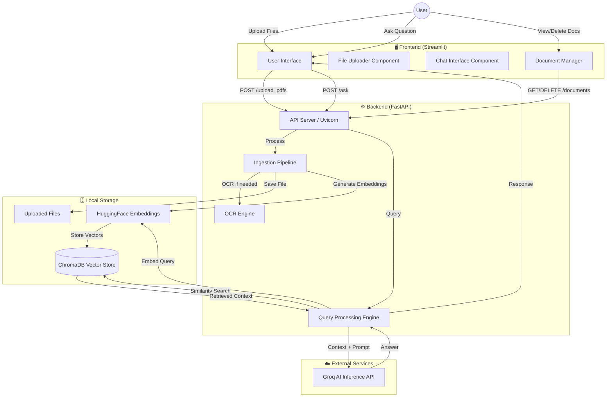

# 🤖 RagBot 2.0 - Production-Ready RAG System

**RagBot 2.0** is an advanced, production-ready Retrieval-Augmented Generation (RAG) system that enables intelligent conversations with your documents. Built with privacy-first principles, it processes PDFs, Excel files, and images locally using state-of-the-art AI models.


> **📘 Technical Deep Dive**: For detailed architecture and data flow, see [ARCHITECTURE.md](./ARCHITECTURE.md).

---

## ✨ Key Features

### 🎯 Core Capabilities
- **Multi-Format Support**: Process PDFs, Excel sheets (.xlsx/.xls), and images (PNG/JPG)
- **OCR Integration**: Extract text from scanned documents and images using RapidOCR + PyMuPDF
- **Intelligent Retrieval**: Context-aware answers using semantic search (6-chunk retrieval)
- **Document Management**: List, view, and delete uploaded documents from the knowledge base
- **Real-time Chat**: Interactive conversation interface with chat history

### 🎨 User Experience
- **Modern Dark Mode UI**: Professional purple-gradient theme with responsive design
- **Mobile-Friendly**: Fully responsive layout for desktop and mobile devices
- **Welcome Messages**: Contextual help for new users
- **Clear Chat**: One-click conversation reset
- **Source Citations**: View which documents were used to generate answers

### 🛡️ Production-Ready
- **Input Validation**: Empty question and database checks with user-friendly errors
- **Timeout Handling**: Smart timeouts (10s for quick ops, 60s for LLM)
- **Connection Error Recovery**: Graceful degradation when backend is offline
- **Error Messages**: Friendly, actionable error messages (not raw exceptions)
- **Auto-Reload**: Backend hot-reloads on code changes during development

---

## 🏗️ System Architecture

### High-Level Data Flow



---

## 📂 Project Structure

```bash
RagBot-2.0/
├── 📁 client/                       # Frontend Application (Streamlit)
│   ├── app.py                       # Main entry point. Orchestrates UI layout
│   ├── style.css                    # Custom CSS for dark mode theme
│   ├── config.py                    # Global configurations (API URLs)
│   ├── 📁 .streamlit/
│   │   └── config.toml              # Streamlit theme configuration
│   ├── 📁 components/               # Reusable UI Modules
│   │   ├── upload.py                # File upload & document management UI
│   │   ├── chatUI.py                # Chat interface with history
│   │   └── history_download.py     # Chat export functionality
│   ├── 📁 utils/                    # Frontend Utilities
│   │   └── api.py                   # API client (requests wrapper)
│   └── requirements.txt             # Frontend dependencies
│
├── 📁 server/                       # Backend Application (FastAPI)
│   ├── main.py                      # API Gateway: Endpoints & middleware
│   ├── logger.py                    # Logging configuration
│   ├── ingestion.log                # Ingestion process logs
│   ├── requirements.txt             # Backend dependencies
│   ├── .env                         # Environment variables (API Keys)
│   │
│   ├── 📁 modules/                  # Core Business Logic
│   │   ├── load_vectorstore.py      # ETL: PDF/Excel/Image → Embeddings → ChromaDB
│   │   ├── query_handlers.py        # Query Pipeline: Retrieval + LLM
│   │   └── llm.py                   # LLM Interface: Groq/Llama-3.3 + Prompts
│   │
│   ├── 📁 chroma_db/                # (Auto-generated) Vector Database
│   └── 📁 uploaded_pdfs/            # (Auto-generated) Document Storage
│
├── ARCHITECTURE.md                  # Detailed technical documentation
└── README.md                        # This file
```

---

## 🔧 Technology Stack

| Component | Technology | Why? |
|-----------|-----------|------|
| **Backend Framework** | FastAPI | High performance, async support, auto-generated API docs |
| **Frontend Framework** | Streamlit | Rapid UI development, built-in chat components |
| **Vector Database** | ChromaDB | Embedded, no Docker needed, persistent storage |
| **Embeddings** | HuggingFace `all-MiniLM-L6-v2` | Fast, accurate, runs locally (384-dim vectors) |
| **LLM** | Groq Llama-3.3-70B | Ultra-fast inference (500+ tokens/sec) |
| **OCR Engine** | RapidOCR + PyMuPDF | Extract text from scanned PDFs and images |
| **Text Splitting** | LangChain RecursiveCharacterTextSplitter | Semantic chunking (1000 chars, 200 overlap) |
| **HTTP Client** | Requests | Timeout handling, connection error recovery |

---

## 🚀 Installation & Setup

### Prerequisites
- Python 3.10 or higher
- [Groq API Key](https://console.groq.com/) (Free tier available)

### 1. Backend Setup

```bash
cd server
pip install -r requirements.txt
```

Create a `.env` file in the `server` folder:
```env
GROQ_API_KEY="your_actual_api_key_here"
```

Start the server:
```bash
uvicorn main:app --reload
```

Wait for: `✅ OCR Engine initialized` and `Application startup complete`.

### 2. Frontend Setup

Open a **new terminal**:
```bash
cd client
pip install -r requirements.txt
streamlit run app.py
```

The app will open at `http://localhost:8501`.

---

## 📖 Usage Guide

### 1. Upload Documents
- Click **"Browse files"** in the sidebar
- Select PDFs, Excel files, or images
- Click **"Upload to DB"**
- Wait for ✅ success message

### 2. Ask Questions
- Type your question in the chat input
- Press Enter
- View the AI's response with source citations

### 3. Manage Documents
- View uploaded documents in the **"Knowledge Base"** section
- Click 🗑️ to delete any document
- Click **"Refresh"** to update the list

### 4. Clear Chat
- Click the **🗑️ Clear** button next to the chat header

---

## 🎯 Best Practices

### For Best Results
- **Upload relevant documents first** before asking questions
- **Be specific** in your questions (e.g., "What is the candidate's email?" vs "Tell me about this")
- **Check sources** to verify which documents were used

### Performance Tips
- **Chunk size**: 1000 characters with 200 overlap (optimized for CVs and reports)
- **Retrieval**: Top 6 most relevant chunks (balances context vs speed)
- **Timeout**: 60 seconds for LLM operations (adjust in `client/utils/api.py` if needed)

---

## 🐛 Troubleshooting

| Issue | Solution |
|-------|----------|
| "Backend offline" | Restart uvicorn: `uvicorn main:app --reload` |
| "Request timed out" | Check if backend is still initializing (wait 30s) |
| "No documents uploaded" | Upload files first before asking questions |
| "Empty question" | Type a valid question (not blank) |
| OCR not working | Ensure `rapidocr-onnxruntime` and `pymupdf` are installed |

---

## 🔐 Privacy & Security

- **Local Processing**: All embeddings generated locally (no data sent to external services except LLM queries)
- **API Key Security**: Store Groq API key in `.env` (never commit to Git)
- **Data Persistence**: Documents stored locally in `server/uploaded_pdfs/`
- **Vector Storage**: ChromaDB persists to `server/chroma_db/`

---

## 🛣️ Roadmap

- [ ] Multi-user support with authentication
- [ ] Support for more file formats (Word, PowerPoint)
- [ ] Advanced filters (date range, document type)
- [ ] Export chat history as PDF
- [ ] Batch document upload
- [ ] Custom embedding models

---

## 📄 License

This project is licensed under the MIT License.

---

## 🙏 Acknowledgments

Built with:
- [LangChain](https://github.com/langchain-ai/langchain) - RAG framework
- [ChromaDB](https://www.trychroma.com/) - Vector database
- [Groq](https://groq.com/) - Ultra-fast LLM inference
- [Streamlit](https://streamlit.io/) - Frontend framework
- [FastAPI](https://fastapi.tiangolo.com/) - Backend framework

---

**Made with ❤️ by Avishek Giri**
